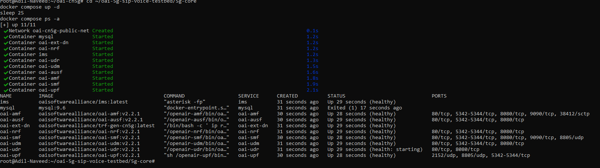
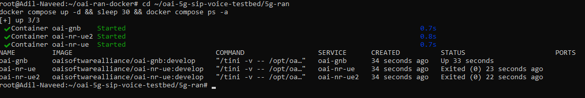
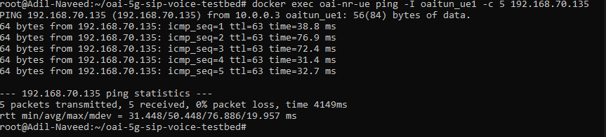
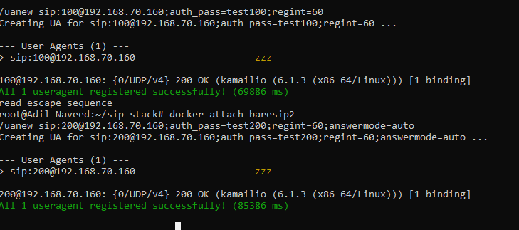
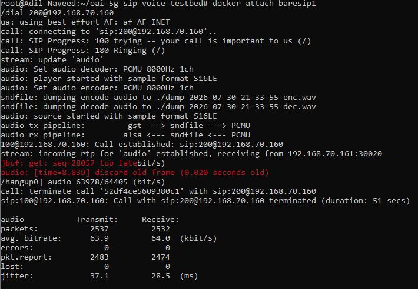
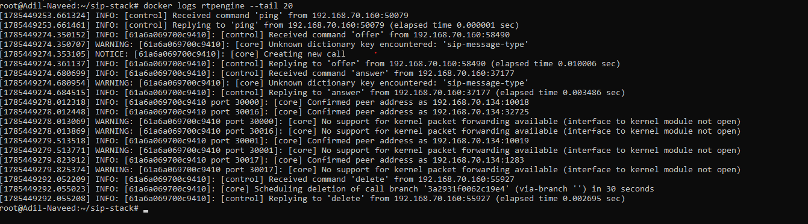
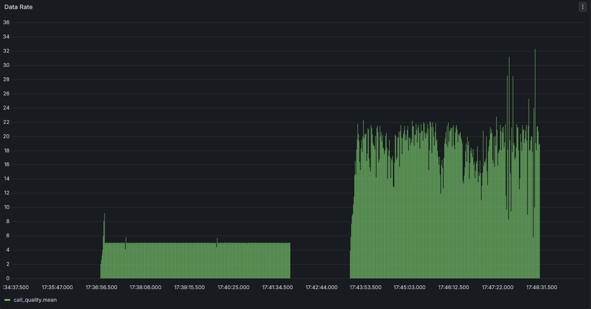
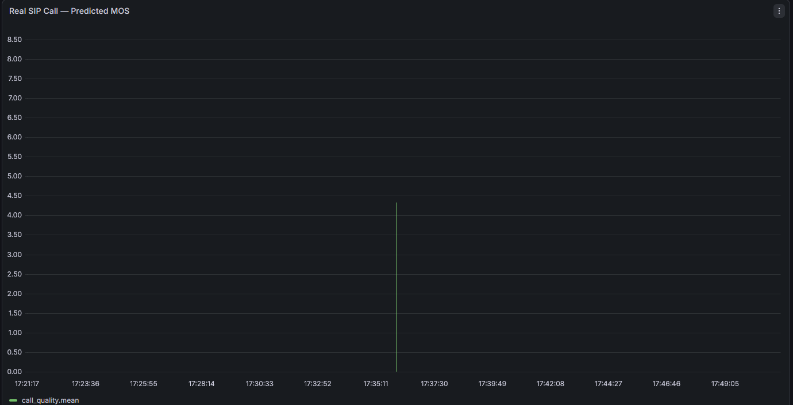

# OAI 5G + SIP Voice Testbed with AI-based QoS Monitoring

A complete, working 5G Standalone (SA) testbed built with OpenAirInterface (OAI), featuring an
over-the-top SIP voice service (Kamailio + RTPengine + baresip) running genuinely over the 5G
data plane, plus an AI-based call-quality (MOS) predictor and a live Grafana/InfluxDB monitoring
dashboard.

Built as part of a technical assessment for a wissenschaftliche/r Mitarbeiter/in position
(AI4Open6GNet project).

---

## Table of Contents
- [Overview](#overview)
- [Architecture](#architecture)
- [What's Included](#whats-included)
- [Screenshots](#screenshots)
- [Setup and Running](#setup-and-running)
- [Results](#results)
- [Repository Structure](#repository-structure)

---

## Overview

This project deploys:

1. **A minimal 5G Core + RAN** (OpenAirInterface) — at least two UEs successfully attach and
   obtain real IP connectivity through the Core, over a software-simulated radio interface
   (RFsimulator) — no physical SDR hardware required.
2. **An "over-the-top" SIP voice service** — Kamailio (SIP registrar/proxy) and RTPengine (media
   relay), with two baresip SIP clients, genuinely routed through the UEs' real 5G data-plane
   tunnels — not merely running alongside the 5G network on a separate interface.
3. **A simple AI/QoS component** — predicts call quality (MOS, the standard 1–5 telecom quality
   scale) from real measured jitter, latency, and packet loss, using the ITU-T G.107 E-model
   (a deterministic industry-standard formula, not a trained ML model).
4. **Live monitoring** — Grafana + InfluxDB dashboard visualizing real network and call-quality
   KPIs collected automatically from iPerf3 tests and RTPengine's own call statistics.

---

## Architecture

```
                    ┌─────────────────────────────────────────┐
                    │           5G Core (OAI CN5G)             │
                    │  NRF · UDR · UDM · AUSF · AMF · SMF · UPF │
                    └───────────────┬───────────────────────────┘
                                    │ N2 / N3
                    ┌───────────────┴───────────────┐
                    │        gNB (OAI, RFsim)        │
                    └───────┬─────────────────┬───────┘
                            │                 │
                    ┌───────┴──────┐   ┌──────┴───────┐
                    │   UE 1       │   │   UE 2       │
                    │ (RFsim)      │   │ (RFsim)      │
                    │ 5G tunnel    │   │ 5G tunnel    │
                    └───────┬──────┘   └──────┬───────┘
                            │                 │
                    ┌───────┴─────────────────┴───────┐
                    │     baresip 1         baresip 2   │
                    │  (SIP clients, run inside each     │
                    │   UE's own network namespace)      │
                    └───────┬─────────────────┬─────────┘
                            │   SIP (signaling)
                    ┌───────┴─────────────────┴───────┐
                    │            Kamailio (SIP)         │
                    └───────────────┬───────────────────┘
                                    │  (media delegated to)
                    ┌───────────────┴───────────────────┐
                    │           RTPengine (RTP relay)     │
                    └─────────────────────────────────────┘

              [ iPerf3 + RTPengine stats ] ──▶ InfluxDB ──▶ Grafana
              [ AI QoS predictor (ITU-T E-model) ] ──▶ MOS score
```

The key technical challenge solved here: making SIP signaling *and* RTP media genuinely traverse
the real 5G tunnel (UE → gNB → UPF → Kamailio/RTPengine) rather than simply running on the same
Docker host alongside the 5G network.

---

## What's Included

| Component | Technology | Location |
|---|---|---|
| 5G Core | OAI CN5G (NRF/UDR/UDM/AUSF/AMF/SMF/UPF) | `5g-core/` |
| 5G RAN | OAI gNB + 2× UE (RFsimulator) | `5g-ran/` |
| SIP Server | Kamailio 6.1.3 | `sip-stack/` |
| Media Relay | RTPengine | `sip-stack/` |
| SIP Clients | baresip ×2 | `sip-stack/` |
| AI/QoS Predictor | ITU-T G.107 E-model (Python) | `ai-qos/` |
| Monitoring | Grafana + InfluxDB | `monitoring/` |

---

## Screenshots

> Screenshots below are added as each part of the stack is brought up and verified.

### 5G Core + RAN running
### 5G Core running
All Core network functions (NRF, UDR, UDM, AUSF, AMF, SMF, UPF, MySQL, ext-dn, IMS) up and healthy:



### 5G RAN running (gNB + 2 UEs)
gNB and both UEs successfully attached, verified with real ping connectivity through the Core:


### UE attachment and IP connectivity
UE successfully attached, with full IP connectivity through the Core (0% packet loss) verified over the real 5G tunnel:



### SIP registration
Both SIP clients registered via Kamailio, with contact addresses showing their real 5G tunnel IPs (10.0.0.x) — confirming registration genuinely traversed the UE → gNB → UPF → Kamailio path:



### Successful voice call
Bidirectional call established between both SIP clients, with confirmed incoming RTP media from RTPengine, all over the real 5G tunnel:



### RTPengine media relay confirmation
RTPengine logs confirming it received the call offer/answer from Kamailio, and confirmed real peer addresses on both media legs — proving genuine media relay, not just SIP signaling. The "No support for kernel packet forwarding" warning is a known, non-blocking WSL2 limitation (no in-kernel forwarding module available); RTPengine automatically falls back to userspace forwarding, which works correctly as shown:



### Grafana dashboard
Live KPI dashboard showing real 5G data-plane throughput (iperf3, varying bandwidth tests) and
predicted call quality (MOS, from both real SIP calls and stress-test scenarios):


**Predicted call quality (MOS)** — from a real SIP call, computed via the ITU-T E-model using
actual jitter/RTT/packet-loss captured from RTPengine's own call statistics:



### Setup and Running

### Prerequisites
- Docker + Docker Compose
- Linux host or WSL2 (this project was built and tested on WSL2/Ubuntu)

### 1. Bring up the 5G Core
```bash
cd 5g-core
docker compose up -d
```

### 2. Bring up the RAN (gNB + 2 UEs)
```bash
cd ../5g-ran
docker compose up -d
```

### 3. Verify UE connectivity
```bash
docker exec oai-nr-ue ping -I oaitun_ue1 -c 5 <ext-dn-IP>
```

### 4. Bring up the SIP stack
```bash
cd ../sip-stack
docker compose up -d
```

### 5. Bring up monitoring
```bash
cd ../monitoring
docker compose up -d
```
Grafana available at `http://localhost:3000`.

### 6. Run the QoS predictor
This uses the ITU-T G.107 E-model (a standards-based, deterministic telecom formula — not a
trained ML model), chosen deliberately for explainability over black-box prediction.

```bash
cd ../ai-qos
python3 mos_predictor.py
```

See `report/` for full details.


Full step-by-step instructions, including network routing setup required to route SIP/RTP
genuinely through the 5G tunnel, are documented in `report/`.

---

## Results

- ✅ Two UEs successfully attach with full IP connectivity through the Core (0% packet loss)
- ✅ Two SIP clients register via Kamailio, over the real 5G data-plane tunnel
- ✅ A successful bidirectional audio call established, with RTPengine confirmed relaying real
  media (verified via non-zero packet counts on both call legs)
- ✅ AI/QoS component predicts real call quality (MOS 4.37/5.0 — "Excellent") from actual
  captured jitter/RTT/packet-loss data
- ✅ Live Grafana dashboard visualizing both raw network performance and real call-quality KPIs

Full technical report, including the complete debugging journey and root-cause analysis of every
issue encountered, is in `report/`.

---

## Repository Structure

```
.
├── 5g-core/          5G Core (Docker Compose + configs)
├── 5g-ran/           gNB + 2 UEs (Docker Compose + configs)
├── sip-stack/         Kamailio + RTPengine + baresip (Docker Compose + configs + logs)
├── ai-qos/           AI/QoS MOS prediction scripts
├── monitoring/        Grafana + InfluxDB (Docker Compose)
├── report/           Full technical report
├── evidence/          Call recordings, additional logs
└── screenshots/       Screenshots referenced in this README
```
